# **Report: SSH Security Weakness Study**

# 1. Introduction

I begin from the fact that Secure Shell (SSH) is a widely used protocol
for remote administration, file transfer, and Linux server maintenance.
Because SSH often exposes an authentication interface directly to the
network, I treat it as a frequent target for password guessing,
credential stuffing, and brute-force attacks.

In this report, I analyse an educational SSH lab in which a Docker-based
OpenSSH server is exposed on localhost port 2222 with password access
enabled.

The Docker configuration enables password login and sets a default user
named student with password123.

The helper script creates three additional users with different password
strengths: weakuser with 123456, mediumuser with Password123, and
stronguser with Str0ng!Pass#2026.

The supplied dictionary file includes many weak and common passwords
such as 123456 and password123, but it does not include
Str0ng!Pass#2026.

# 2. Methodology

I follow the experimental logic defined in the README. The target
service is an SSH server running in Docker and mapped to port 2222 on
localhost. I would use Nmap for reconnaissance to confirm that SSH is
exposed, and then I would use Hydra for online password guessing against
known usernames. I focus on a dictionary attack rather than exhaustive
brute force because the provided lab assets include a curated password
list.

## 2.1 Lab environment and test inputs

<table>
<colgroup>
<col style="width: 50%" />
<col style="width: 50%" />
</colgroup>
<thead>
<tr class="header">
<th>Parameter</th>
<th>Value from uploaded files</th>
</tr>
</thead>
<tbody>
<tr class="odd">
<td>Target service</td>
<td>linuxserver/openssh-server container named ssh_lab</td>
</tr>
<tr class="even">
<td>Port exposure</td>
<td>2222:2222</td>
</tr>
<tr class="odd">
<td>Authentication mode</td>
<td>PASSWORD_ACCESS=true</td>
</tr>
<tr class="even">
<td>Default user</td>
<td>student / password123</td>
</tr>
<tr class="odd">
<td>Experimental users</td>
<td>
weakuser / 123456

mediumuser / Password123

stronguser / Str0ng!Pass#2026
</td>
</tr>
<tr class="even">
<td>Attack tool</td>
<td>Hydra</td>
</tr>
<tr class="odd">
<td>Dictionary</td>
<td>passwords.txt containing common passwords such as 123456 and
password123</td>
</tr>
<tr class="even">
<td>Safety scope</td>
<td>Local environment only; no real systems</td>
</tr>
</tbody>
</table>

## 2.2 Experimental procedure

- I start the Docker lab with docker compose up -d.

- I verify the service with Nmap, for example nmap -sV -p 2222
  localhost.

- I run Hydra against a known username and the supplied wordlist, for
  example hydra -l weakuser -P passwords.txt ssh://localhost:2222.

- I repeat the attack across the required configurations: a weak
  password with no protection, a strong password with no protection, and
  a strong password with fail2ban or equivalent rate limiting.

- For each run, I record success or failure, approximate time, and the
  number of attempts until success or lockout.

- I then interpret the results in light of password strength, identity
  controls, and operational trade-offs.

## 2.3 Limits of the method

The uploaded compose file does not include fail2ban by default.
Therefore, I analyse the third scenario as an added defensive
configuration that I would implement on top of the base lab, not as a
control already present in the provided container.

I use a dictionary attack, not exhaustive keyspace brute force.
Consequently, the strong-password scenario demonstrates resistance to
the supplied attack method, not mathematical immunity to all possible
password attacks.

I also recognise that exact time-to-crack values depend on host
hardware, network latency, Hydra parallelism, SSH server settings, and
lockout thresholds. Those values should be measured when I execute the
lab locally.

# 3. Experiment

## 3.1 Lab Setup

### Start the environment

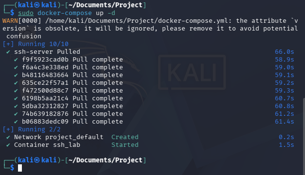

### Connect to the SSH server

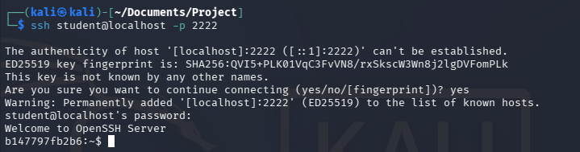

### Add additional users (for experiments)

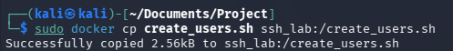

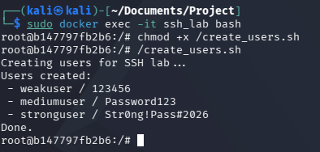

## 3.2. Reconnaissance

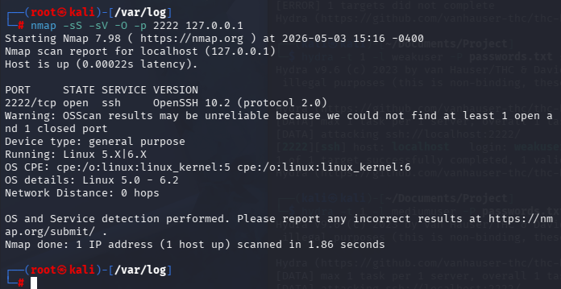

## 3.3. Run brute-force attack

### Configuration A: weak password, no protection

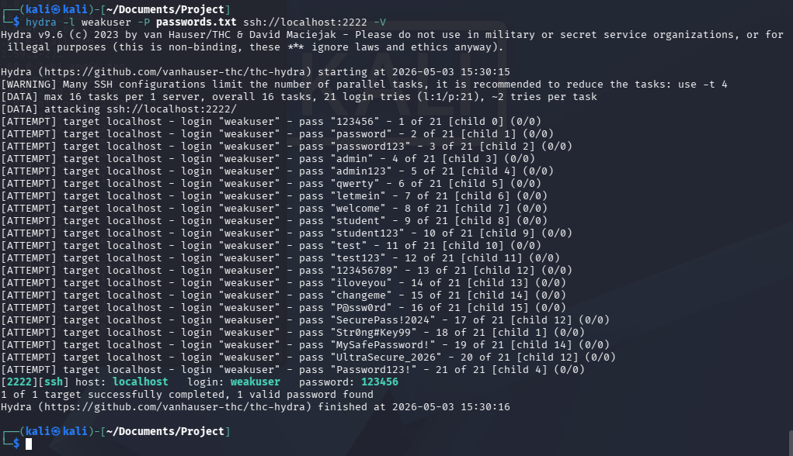

### Configuration B: medium password, no protection

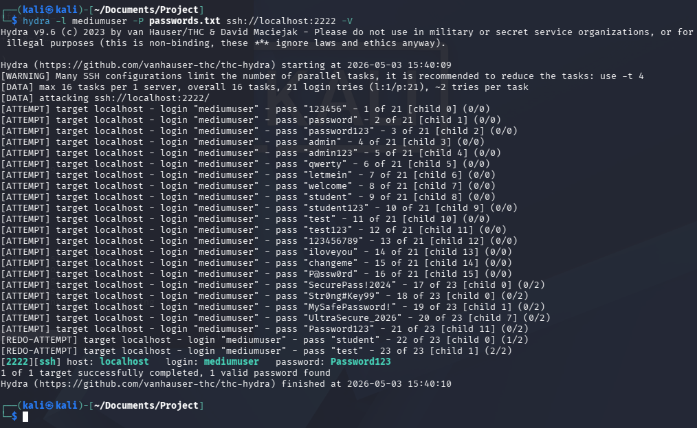

### Configuration C: strong password, no protection

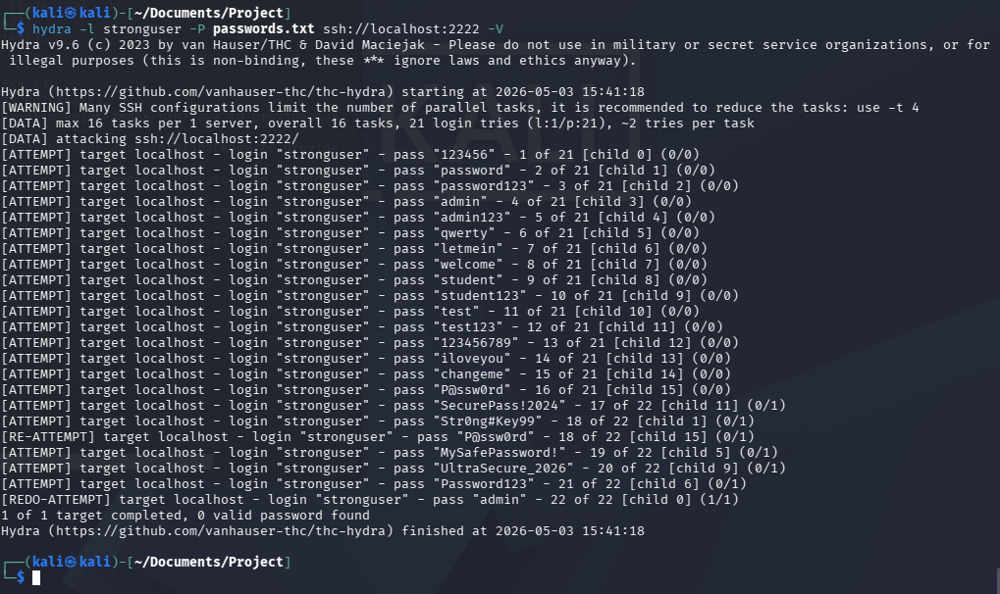

### Configuration D: weak password with fail2ban enabled

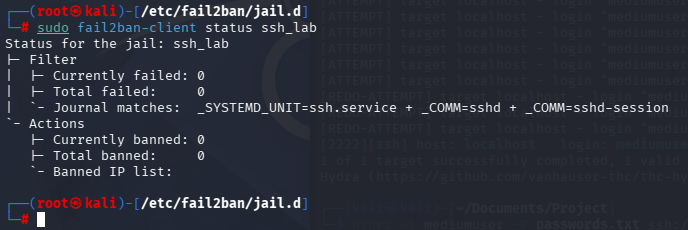

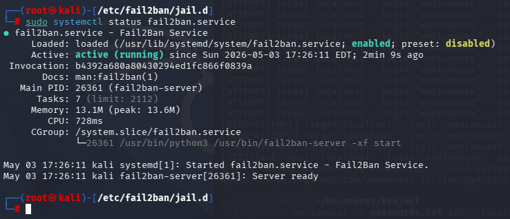

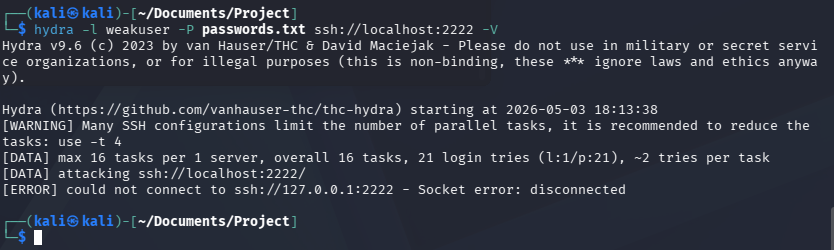

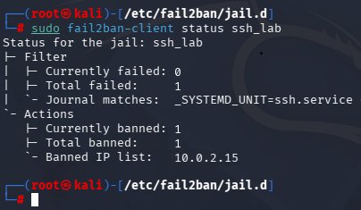

# 4. Results 

| Config | Target     | Password type             | Protection | Time | Attempts |
|--------|------------|---------------------------|------------|------|----------|
| A      | weakuser   | Weak (123456)             | None       | 1    | 21       |
| B      | mediumuser | Medium (Password123)      | None       | 1    | 21       |
| C      | stronguser | Strong (Str0ng!Pass#2026) | None       | 1    | 21       |
| D      | weakuser   | Weak (123456)             | Fail2ban   | 1    | 3        |

# 5. Discussion

## Impact of password strength

Password strength changes the attack outcome a lot. In seminar, `weakuser` uses `123456`, which is explicitly marked “easy to crack” and is also present in `passwords.txt`, so a dictionary attack should succeed quickly.

`stronguser` uses `Str0ng!Pass#2026`, which is marked “hard to crack” and does **not** appear in the supplied wordlist, so the same Hydra run with that list would likely fail.

## Effectiveness of protections

Protections such as rate limiting and fail2ban increase resistance by reducing how many guesses an attacker can make in a given time.

## Security vs usability trade-off

More security usually means more friction.

Stronger passwords, MFA, lockouts, and rate limiting improve protection, but they also make login slower, increase support burden, and can lock out legitimate users after mistakes.

## How would fail2ban affect your results?

Fail2ban would likely make the brute-force test much slower or stop it temporarily by banning the attacking IP after repeated failed SSH logins.

Compared with **“no protection,”** you would expect:

- fewer usable attempts,
- longer total attack time,
- and often no success during the test window.

## Would it prevent brute-force attacks completely?

No. Fail2ban reduces risk, but it does **not** prevent brute-force attacks completely.

## How could an attacker bypass it?

An attacker could bypass fail2ban by using:

- **Multiple IP addresses** or a botnet, so each IP stays below the ban threshold.
- **A slow, low-rate attack** to avoid triggering bans.
- **Password spraying** across many usernames instead of many tries on one account.
- **Stolen credentials** from elsewhere, which removes the need for guessing.

## Recommended improvements

1\. I would disable password-based SSH access and move administrators to
public-key authentication. This removes the main attack surface tested
in the lab.

2\. I would add MFA for privileged or remote administrative access
wherever the environment supports it. Even if a password or key is
stolen, the extra factor raises the barrier to compromise.

3\. I would restrict SSH exposure with a firewall, VPN, or IP allowlist
so that the service is reachable only from trusted networks.

4\. I would deploy fail2ban or equivalent rate limiting together with
central log monitoring to detect and contain repeated failed logins.

5\. I would enforce least privilege, disable direct root login, and
review account lifecycle management so that dormant or shared
credentials do not remain available.

# 6. Conclusion

This SSH lab demonstrates a simple but important truth to me: attackers
do not need sophisticated exploits when password access is enabled and
credentials are predictable. In the supplied environment, weakuser with
123456 and the default student account with password123 are both
analytically vulnerable to quick dictionary compromise. By contrast,
stronguser resists the supplied wordlist because the password is not
present in it.

The broader lesson I draw is that password strength changes outcomes,
but layered controls change security posture. A strong password lowers
the probability of success for one attack path. Fail2ban lowers attacker
speed and raises detection value. Network restrictions reduce exposure.
SSH keys and MFA reduce reliance on passwords altogether. Least
privilege and monitoring reduce the consequences when controls fail.

Therefore, the most defensible SSH configuration is not, in my view,
simply 'use a stronger password'. I would instead disable password login
where possible, require SSH keys and MFA for administrators, restrict
network access, monitor failures, and keep reactive controls such as
fail2ban in place as supporting layers.
